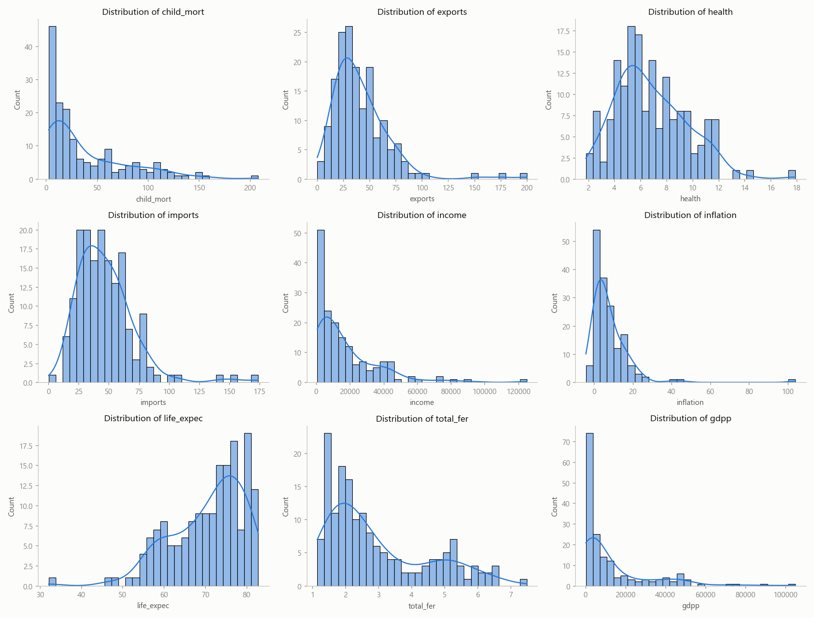
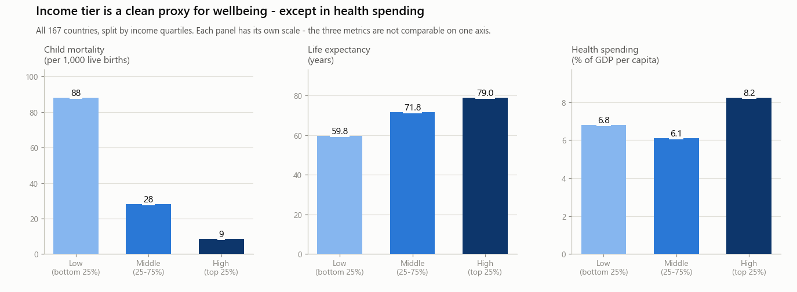
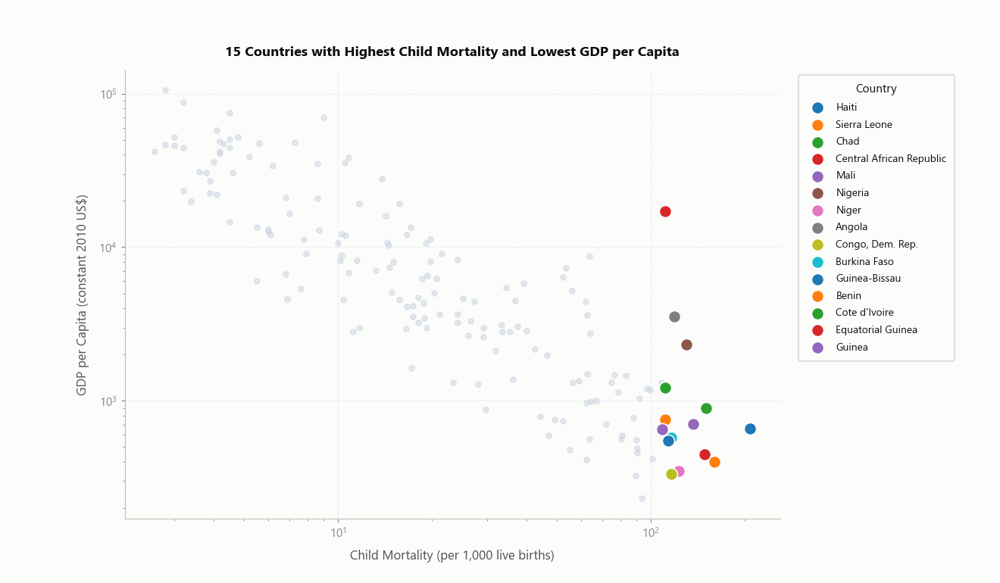
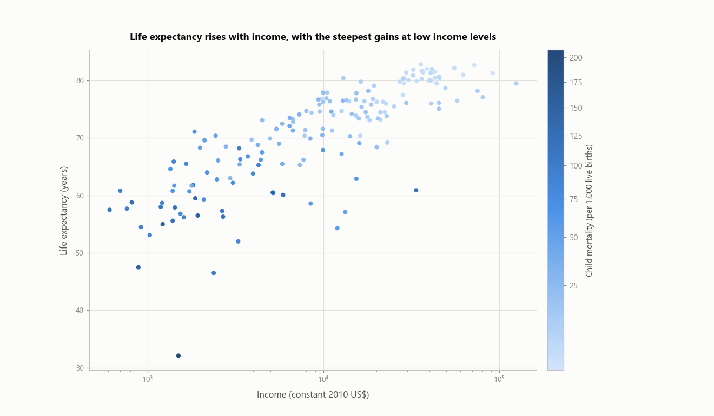
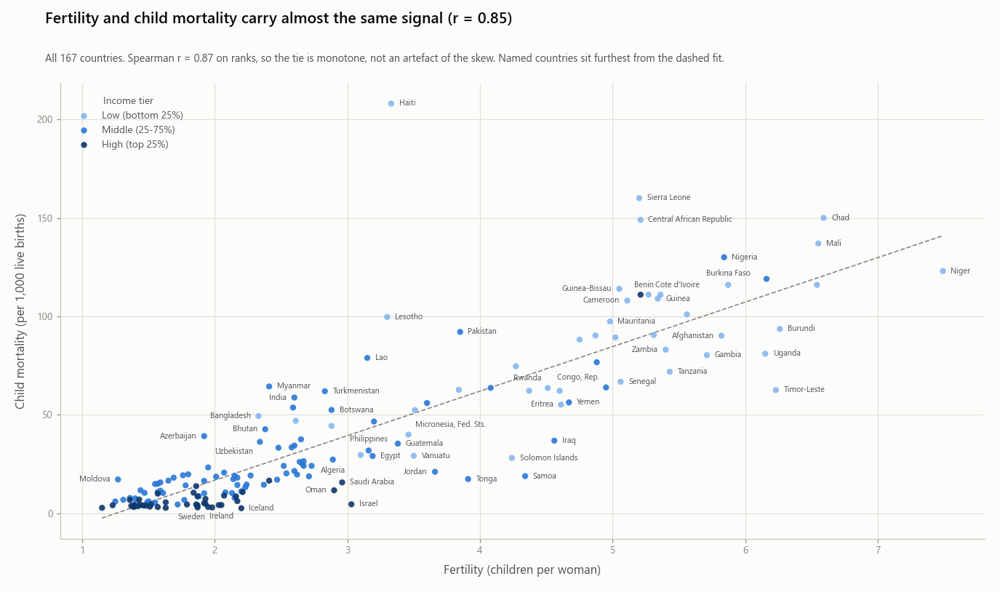
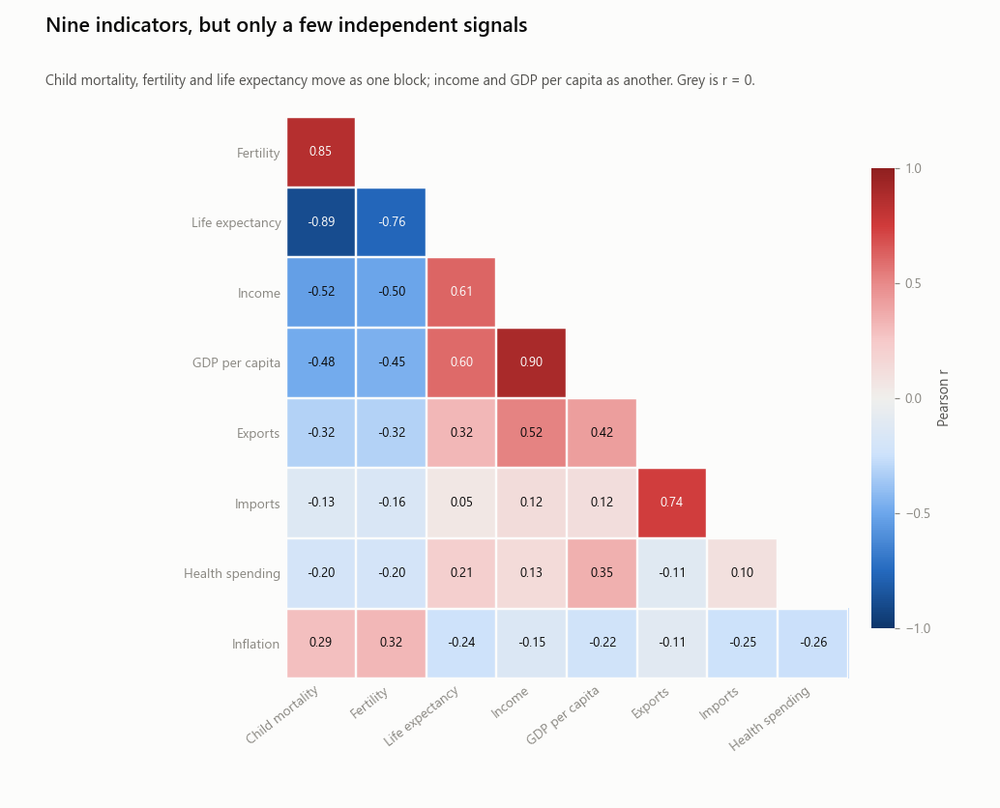
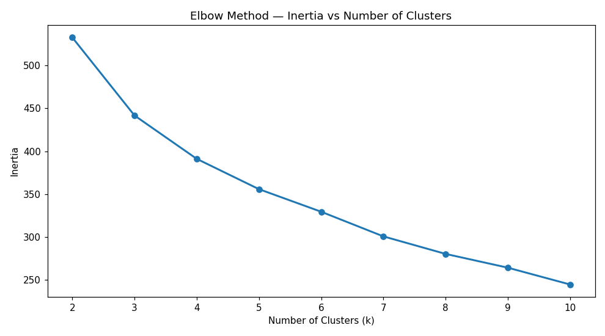
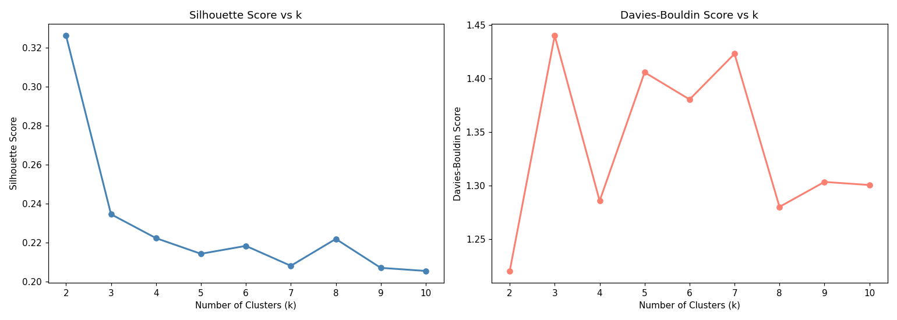
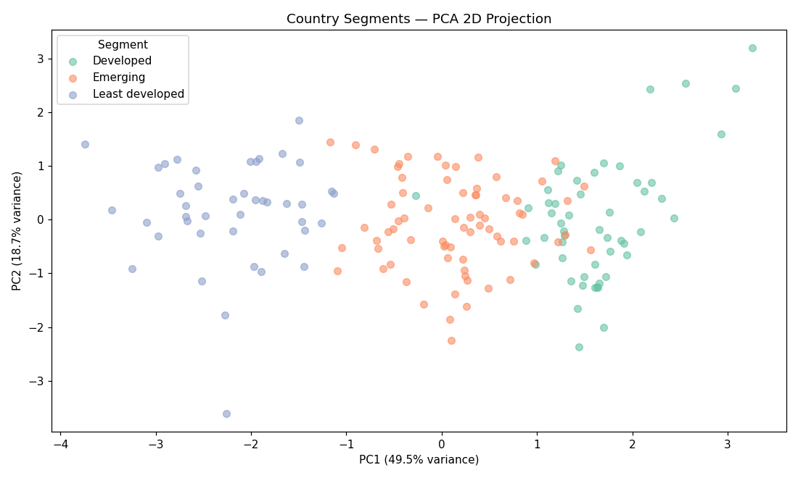
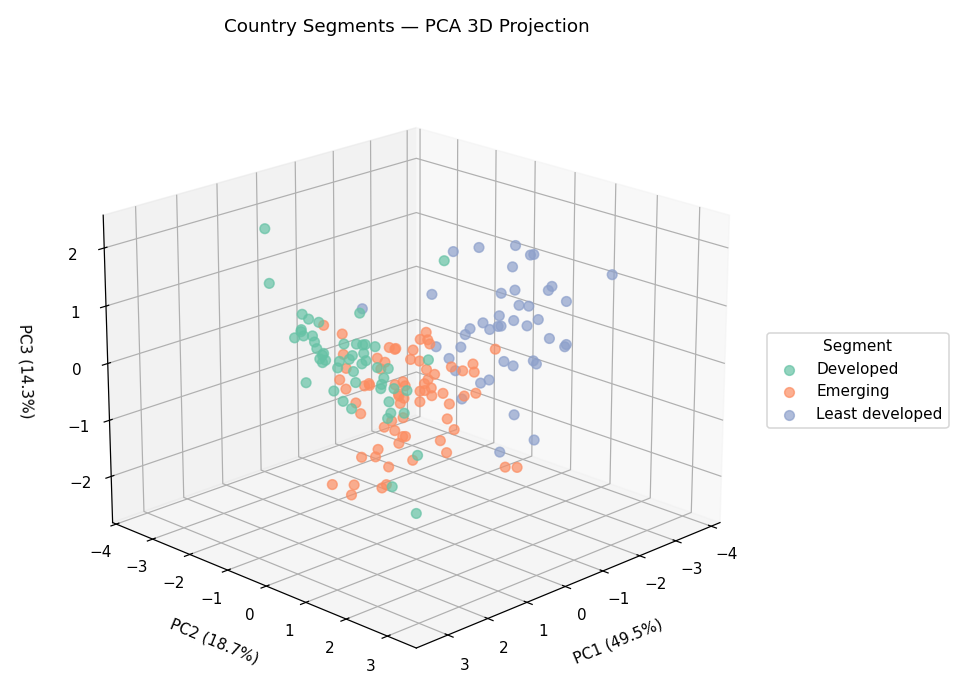

# Country Socioeconomic & Health Profiling

Unsupervised clustering of **167 countries** on 9 socio-economic and health indicators, to
group them by development status and support international aid allocation.

The question this repository answers: *given only these 9 indicators, which countries form a
coherent "needs aid" group, and does that group agree with the obvious hand-picked shortlist?*

**Headline result.** K-Means at k=3 on the scaled, skew-corrected matrix separates the 167
countries into **43 least-developed**, **72 emerging** and **52 developed** economies. The
least-developed cluster averages **95 child deaths per 1,000 live births** against **7** in the
developed cluster, with **$948** GDP per capita against **$29,717** — a 13× mortality gap and a
31× GDP gap. Of the 15 countries a manual "highest child mortality, lowest GDP" screen
picks out, **14 fall inside that cluster** without being told to.

---

## Dataset Overview

* **Source:** https://www.kaggle.com/datasets/rohan0301/unsupervised-learning-on-country-data/data
* **Records:** 167 countries, one row each
* **Features:** 10 variables (1 string identifier, 9 numeric metrics)
* **Missing values:** none — 100% complete across all 167 rows
* **Duplicates:** none

### Data Dictionary

| Feature Column | Data Type | Description | Range (Min – Max) |
| :--- | :--- | :--- | :--- |
| `country` | String | Name of the country | 167 unique countries |
| `child_mort` | Float | Deaths of children under 5 per 1,000 live births | 2.60 – 208.00 |
| `exports` | Float | Exports of goods/services per capita (% of GDP per capita) | 0.11% – 200.00% |
| `health` | Float | Total health spending per capita (% of GDP per capita) | 1.81% – 17.90% |
| `imports` | Float | Imports of goods/services per capita (% of GDP per capita) | 0.07% – 174.00% |
| `income` | Integer | Net income per person (USD) | $609 – $125,000 |
| `inflation` | Float | Annual growth rate of total GDP (%) | −4.21% – 104.00% |
| `life_expec` | Float | Life expectancy at birth (years) | 32.10 – 82.80 |
| `total_fer` | Float | Children born per woman at current age-fertility rates | 1.15 – 7.49 |
| `gdpp` | Integer | GDP per capita (USD) | $231 – $105,000 |

### Distribution summary



Three features are severely right-skewed and drive most of the preprocessing decisions —
the mean sits far above the median in each:

| Feature | Mean | Median | Max | Note |
| :--- | ---: | ---: | ---: | :--- |
| `child_mort` | 38.27 | 19.30 | 208.00 | Haiti at the top |
| `income` | 17,145 | 9,960 | 125,000 | mean is 1.7× the median |
| `gdpp` | 12,964 | 4,660 | 105,000 | mean is 2.8× the median |
| `inflation` | 7.78 | 5.39 | 104.00 | Nigeria at 104%; 8 countries negative |
| `exports` | 41.11 | 35.00 | 200.00 | Myanmar at 0.109 |
| `imports` | 46.89 | 43.30 | 174.00 | Myanmar at 0.066 |
| `life_expec` | 70.56 | 73.10 | 82.80 | left-skewed |
| `total_fer` | 2.95 | 2.41 | 7.49 | |
| `health` | 6.82 | 6.32 | 17.90 | most symmetric of the nine |

---

## Project Flow

```
data/raw_data/Country-data.csv          167 × 10, raw
        │
        ├── notebook/eda.ipynb          data understanding + Q1–Q4
        │                               → establishes that the 9 features are not
        │                                 9 independent signals
        │
        ├── notebook/preprocessing.ipynb
        │        df → X (country as index)
        │           → X_log      (income, gdpp)
        │           → X_yj       (inflation, exports, imports)
        │           → X_scaled   (RobustScaler, all 9)
        │        └─→ data/preprocessed_data/preprocessed_data.csv    167 × 9
        │
        └── notebook/modelling.ipynb
                 k selection (elbow + silhouette + Davies-Bouldin + Calinski-Harabasz)
                 → K-Means k=3
                 → cluster profiling and naming by development score
                 → PCA (2D and 3D) for projection
                 → aid shortlist
```

Each pipeline stage is a **new DataFrame** rather than an in-place mutation, so cells are
re-runnable. An earlier in-place version silently produced `log(log(gdpp))` on a second run.

---

## Exploratory Data Analysis

Four questions, each with a chart in `notebook/eda.ipynb`. Charts follow a fixed house style
defined once in cell `09fffd3d`: one y-axis per plot, a one-hue sequential ramp for magnitude,
a diverging ramp with neutral grey at zero for signed values, ordinal colours for income tiers,
log axes for `income`/`gdpp`, and titles that state the finding rather than the variable names.

### Q1 — Income tiers vs wellbeing

Countries bucketed into tiers by income quartiles (`qcut` at 0/25/75/100), then compared on
three metrics. Three panels, because `child_mort` (2.6–208), `life_expec` (32–82) and `health`
(1.8–17.9) share no common scale.



| Income tier | Countries | Avg child mortality | Avg life expectancy | Avg health spending |
| :--- | ---: | ---: | ---: | ---: |
| Low (bottom 25%) | 42 | 88.06 | 59.76 | 6.81% |
| Middle (25–75%) | 83 | 28.12 | 71.77 | 6.11% |
| High (top 25%) | 42 | 8.54 | 78.95 | 8.23% |

**Finding.** Income tier is a clean proxy for wellbeing on two of the three metrics — child
mortality falls **10×** from the low to the high tier and life expectancy rises **19 years**.
Health spending is the exception: it is **not monotonic**. The middle tier spends the *least*
(6.11%), below the low tier (6.81%). Health spending as a share of GDP measures budget
priority, not healthcare capacity, so it carries almost no development signal on its own.

### Q2 — The manual "at risk" shortlist

The 15 countries with the highest child mortality and lowest GDP per capita, sorted
lexicographically (`child_mort` descending, then `gdpp` ascending).



The shortlist sits in the bottom-right corner on both log axes — except for the single red dot
floating an order of magnitude above the rest, which is Equatorial Guinea.

| # | Country | Child mortality | GDP per capita |
| ---: | :--- | ---: | ---: |
| 1 | Haiti | 208.0 | $662 |
| 2 | Sierra Leone | 160.0 | $399 |
| 3 | Chad | 150.0 | $897 |
| 4 | Central African Republic | 149.0 | $446 |
| 5 | Mali | 137.0 | $708 |
| 6 | Nigeria | 130.0 | $2,330 |
| 7 | Niger | 123.0 | $348 |
| 8 | Angola | 119.0 | $3,530 |
| 9 | Congo, Dem. Rep. | 116.0 | $334 |
| 10 | Burkina Faso | 116.0 | $575 |
| 11 | Guinea-Bissau | 114.0 | $547 |
| 12 | Benin | 111.0 | $758 |
| 13 | Cote d'Ivoire | 111.0 | $1,220 |
| 14 | Equatorial Guinea | 111.0 | **$17,100** |
| 15 | Guinea | 109.0 | $648 |

**Finding.** Fourteen of the fifteen are Sub-Saharan African, Haiti excepted. **Equatorial
Guinea is the outlier that matters**: 111 deaths per 1,000 on $17,100 GDP per capita, roughly
25× the wealth of its neighbours in this table. Because the sort is lexicographic, `gdpp` only
breaks exact ties — in practice this is a top-15 by child mortality alone, which is exactly why
Equatorial Guinea slips in. It reappears as the single disagreement with the clustering result
below.

### Q3 — Income vs life expectancy

Scatter of all 167 countries, log x-axis on `income`, coloured by `child_mort` with
`PowerNorm(gamma=0.6)` so the skewed colour variable doesn't collapse into one pale shade.



| Income tier | Avg life expectancy | Avg child mortality |
| :--- | ---: | ---: |
| High (top 25%) | 78.95 | 8.54 |
| Middle (25–75%) | 71.77 | 28.12 |
| Low (bottom 25%) | 59.76 | 88.06 |

**Finding.** The relationship is **concave, not linear**. The steepest gains in life expectancy
happen at the lowest income levels and then flatten — the first few thousand dollars of income
buy far more life expectancy than the next fifty thousand. Child mortality mirrors it in
reverse. Practically: aid targeted at the bottom of the income distribution has more headroom
per dollar than aid spread evenly.

### Q4 — Fertility vs child mortality, and the full correlation structure

A labelled scatter (naming ~55 of the 167 countries via a collision-avoiding placement helper,
prioritised by distance from the fitted line) plus a lower-triangle correlation heatmap of all
9 features.



**Fertility ↔ child mortality:** Pearson **r = 0.85**, Spearman **r = 0.87** on ranks — the tie
is monotone, not an artefact of the skew. A straight-line fit already explains **72%** of the
variance in child mortality, with no curvature left in the residuals.

Countries furthest off that line — where a collapsed "need" signal will describe them worst:

| Country | Residual | Note |
| :--- | ---: | :--- |
| Haiti | +161 | 208 deaths at a fertility of only 3.3 |
| Sierra Leone | +71 | |
| Samoa | −51 | better outcomes than its fertility predicts |
| Timor-Leste | −50 | |



**The nine indicators are not nine independent signals.** They are three blocks and two loners:

| Block | Members | Internal correlation | Note |
| :--- | :--- | :--- | :--- |
| **Need** | `child_mort`, `total_fer`, `life_expec` | \|r\| = 0.76 – 0.89 | `child_mort`~`life_expec` −0.89 |
| **Wealth** | `income`, `gdpp` | r = 0.90 | tied to need at only \|r\| = 0.45–0.61 |
| **Trade** | `exports`, `imports` | r = 0.74 | near-orthogonal to need (`imports`~`child_mort` −0.13) |
| *loner* | `health` | — | strongest tie anywhere is 0.35 (`gdpp`) |
| *loner* | `inflation` | — | strongest tie anywhere is 0.32 (`total_fer`) |

**Why this matters before clustering.** K-Means measures Euclidean distance and gives every
scaled column one equal vote. Feed all nine in unchanged and the need block votes three times,
wealth twice, while `health` and `inflation` vote once each — the distance metric ends up
silently weighted toward need. This is a known and accepted tilt in the result below, not a bug,
but it is the reason PC1 absorbs half the variance on its own.

---

## Preprocessing

Full rationale in `notebook/preprocessing.ipynb`. `country` is an **identifier only** — it never
enters the model matrix, and is kept as the index rather than dropped so cluster labels can be
joined back to country names.

| Feature | Transform | Skew before → after | Why |
| :--- | :--- | :--- | :--- |
| `income` | `np.log` | 2.23 → −0.24 | strictly positive, guarded by an `assert` |
| `gdpp` | `np.log` | 2.22 → 0.01 | strictly positive |
| `inflation` | Yeo-Johnson | 5.15 → 0.18 | 8 countries are negative, so `np.log` gives `NaN` |
| `exports` | Yeo-Johnson | 2.45 → 0.10 | log *runs* but flips skew to −2.72 (Myanmar at 0.109) |
| `imports` | Yeo-Johnson | 1.91 → 0.17 | same, flips to −4.92 (Myanmar at 0.066) |
| `child_mort` | none | 1.45 | moderate |
| `health` | none | 0.71 | moderate |
| `life_expec` | none | −0.97 | moderate |
| `total_fer` | none | 0.97 | moderate |

Then **`RobustScaler` on all 9 features**.

Three decisions worth recording:

- **Why scale at all.** K-Means is Euclidean. On raw units `income` (to 125,000) would drown
  `total_fer` (1.15–7.49) entirely.
- **Why Robust over Standard.** Median and IQR aren't dragged by Haiti (`child_mort` 208),
  Sierra Leone (160) and Chad (150) the way mean and standard deviation are.
- **Why `exports`/`imports` were transformed at all.** Left raw, they spanned ±6.0 while logged
  `income`/`gdpp` spanned ±1.4 — so Euclidean distance was largely measuring *trade openness*,
  and an early k=3 run returned a five-country "biggest exporters" cluster (Singapore,
  Luxembourg, Malta, Ireland, Seychelles).

**No country is capped or dropped.** The outliers are the countries the aid question is about.

---

## Modelling

### Choosing k

K-Means (`k-means++`, `n_init=10`, `random_state=42`) swept over k = 2–10, scored on four
measures.



The elbow is smooth — inertia falls steadily with no decisive bend, which is why it cannot pick
k on its own and three further metrics were computed.



| k | Inertia | Silhouette ↑ | Davies-Bouldin ↓ | Calinski-Harabasz ↑ |
| ---: | ---: | ---: | ---: | ---: |
| 2 | 532.84 | **0.326** | **1.220** | **91.89** |
| **3** | **441.72** | 0.234 | 1.440 | 72.00 |
| 4 | 391.10 | 0.222 | 1.286 | 60.92 |
| 5 | 355.71 | 0.214 | 1.406 | 53.95 |
| 6 | 329.35 | 0.218 | 1.381 | 48.91 |
| 7 | 300.58 | 0.208 | 1.423 | 46.93 |
| 8 | 280.12 | 0.222 | 1.280 | 44.56 |
| 9 | 264.03 | 0.207 | 1.303 | 42.30 |
| 10 | 244.42 | 0.205 | 1.301 | 41.76 |

**k = 3 was chosen, and the internal metrics do not support it — they all point at k = 2.**
Silhouette peaks at 0.326 for k=2 against 0.234 for k=3; Davies-Bouldin is best at k=2; and
Calinski-Harabasz falls monotonically from k=2. k=3 is a judgement call on interpretability:
a two-way rich/poor split cannot distinguish "needs aid now" from "developing but stable,"
which is the distinction the aid question actually turns on. This trade-off is stated here
rather than hidden, because the metrics genuinely argue the other way.

### PCA

Fitted on the 9 scaled features, used for **projection and interpretation only** — the
clustering runs on all 9 features, not on components.

| Component | Explained variance | Cumulative |
| :--- | ---: | ---: |
| PC1 | 49.55% | 49.55% |
| PC2 | 18.69% | 68.24% |
| PC3 | 14.30% | 82.54% |
| PC4 | 7.89% | 90.43% |

Loadings:

| Feature | PC1 | PC2 | PC3 |
| :--- | ---: | ---: | ---: |
| `life_expec` | **+0.435** | −0.231 | −0.076 |
| `child_mort` | **−0.429** | +0.170 | +0.071 |
| `total_fer` | **−0.402** | +0.137 | +0.035 |
| `income` | +0.366 | −0.108 | −0.177 |
| `gdpp` | +0.362 | −0.111 | −0.074 |
| `exports` | +0.311 | **+0.591** | −0.324 |
| `inflation` | −0.258 | −0.168 | **−0.636** |
| `imports` | +0.140 | **+0.696** | +0.145 |
| `health` | +0.132 | −0.120 | **+0.649** |



The separation is almost entirely horizontal — least developed on the left, developed on the
right, emerging spread through the middle with overlap at both edges. PC2 adds nothing to the
split, which is the point: trade openness does not track development.



**PC1 is the development axis**, and it is exactly the structure Q4 predicted: the need block
and the wealth block loading together with opposite signs, absorbing half the total variance
by itself. **PC2 is trade openness** almost on its own (`imports` +0.696, `exports` +0.591) —
the same signal the Yeo-Johnson work existed to stop from dominating distance. **PC3 is health
spending against inflation.**

---

## Results — three development segments

Clusters are named by a **development score** (`gdpp + income + life_expec − child_mort −
total_fer`, valid only because all 9 features share a scale after preprocessing) rather than
hardcoded per cluster id, so the labels re-derive correctly if the seed or k changes.

Means in **original units**, obtained by joining cluster labels back to the raw data:

| Segment | n | Child mort. | Life expec. | Fertility | Income | GDP p.c. | Health | Exports | Imports | Inflation |
| :--- | ---: | ---: | ---: | ---: | ---: | ---: | ---: | ---: | ---: | ---: |
| **Least developed** | 43 | 95.2 | 59.7 | 5.0 | $2,148 | $948 | 6.3% | 23.4% | 41.4% | 11.7% |
| **Emerging** | 72 | 26.7 | 71.4 | 2.6 | $16,174 | $8,041 | 5.6% | 42.2% | 43.5% | 10.0% |
| **Developed** | 52 | 7.2 | 78.4 | 1.7 | $30,890 | $29,717 | 9.0% | 54.2% | 56.1% | 1.5% |

Medians, which are less distorted by the oil states in the middle group:

| Segment | Child mort. | Life expec. | Income | GDP p.c. |
| :--- | ---: | ---: | ---: | ---: |
| Least developed | 90.3 | 60.1 | $1,820 | $708 |
| Emerging | 20.5 | 72.3 | $9,925 | $4,530 |
| Developed | 5.0 | 79.9 | $28,700 | $25,150 |

Cluster cohesion (silhouette per country, averaged within cluster):

| Segment | Mean silhouette | Min | n |
| :--- | ---: | ---: | ---: |
| Least developed | 0.256 | −0.060 | 43 |
| Emerging | 0.209 | 0.000 | 72 |
| Developed | 0.252 | −0.004 | 52 |

No country is badly misassigned (no strongly negative silhouette anywhere). **Emerging is the
loosest cluster**, which is what you would expect of a residual "everything in the middle"
group.

### The aid shortlist — 43 countries

The least-developed cluster, ordered by child mortality:

> Haiti, Sierra Leone, Chad, Central African Republic, Mali, Nigeria, Niger, Angola,
> Congo (Dem. Rep.), Burkina Faso, Guinea-Bissau, Benin, Cote d'Ivoire, Guinea, Cameroon,
> Mozambique, Lesotho, Mauritania, Burundi, Pakistan, Malawi, Togo, Afghanistan, Liberia,
> Comoros, Zambia, Uganda, Gambia, Lao, Sudan, Ghana, Tanzania, Senegal, Myanmar, Rwanda,
> Kiribati, Timor-Leste, Kenya, Madagascar, Yemen, Eritrea, Tajikistan, Nepal

This cluster spans **$231 – $3,600** GDP per capita. Every member has child mortality of at
least **47.0** (Nepal, the lowest) — 2.4× the global median of 19.3 — so the group is cleanly
separated on the metric the aid question cares about, not merely on poverty.

### Cross-check against the Q2 manual shortlist

**14 of the 15** hand-picked countries fall inside the least-developed cluster without the
algorithm being told anything about them. The single disagreement is instructive:

**Equatorial Guinea** — 111 child deaths per 1,000, but $33,700 income and $17,100 GDP per
capita — is assigned to **Emerging**, not Least developed. Q2's lexicographic sort ranked it on
mortality alone; the clustering sees all 9 indicators at once and reads it as a wealthy state
with poor health outcomes rather than a poor one. Whether it belongs on an aid shortlist is a
policy question, not a clustering question, but the two methods disagreeing here is a feature:
it isolates the one country whose need and wealth signals point in opposite directions.

---

## Limitations

- **The internal metrics prefer k = 2.** k = 3 is defended on interpretability alone. A reader
  who weights silhouette above interpretability should read the three-way split as a soft
  structure, not a hard one.
- **"Emerging" is heterogeneous and its name undersells that.** It spans **$758 – $70,300** GDP
  per capita and contains Qatar, Kuwait, Brunei, the UAE, Bahrain and Oman alongside genuine
  middle-income countries, plus eight countries with child mortality above 50 (Botswana, Congo
  Rep., Equatorial Guinea, Gabon, India, Namibia, South Africa, Turkmenistan). It is best read
  as "not clearly in either tail," and its 0.209 silhouette says the same thing.
- **Equal-weighted Euclidean distance is tilted toward need**, because the need block
  contributes three correlated features and wealth two (see Q4). This was accepted rather than
  corrected — the aid question is about need — but it means the clusters are not a neutral
  summary of all nine indicators.
- **`health` carries almost no development signal.** Its strongest correlation with anything is
  0.35, and Q1 showed its tier means are non-monotonic. It is in the model matrix but does
  little work in it.
- **Cross-sectional data, so no causal claims.** Every relationship here is association. Both
  income and health outcomes plausibly reflect common structural determinants.
- **The cluster profile inside `modelling.ipynb` is still in transformed units.** The
  original-unit tables above were produced by joining labels back to the raw CSV; the notebook
  itself has not yet inverse-transformed through the `PowerTransformer` and scaler.

---

## Repository Structure

```text
├── data/
│   ├── raw_data/
│   │   └── Country-data.csv                 # source dataset, 167 × 10
│   └── preprocessed_data/
│       └── preprocessed_data.csv            # model matrix, 167 × 9, country as index
├── docs/
│   └── images/                              # figures used by this README, exported
│                                            # from the notebooks' own chart code
├── notebook/
│   ├── eda.ipynb                            # data understanding + Q1–Q4, owns the chart setup
│   ├── preprocessing.ipynb                  # raw → transform → scale → save
│   └── modelling.ipynb                      # k selection, K-Means, PCA, profiling, shortlist
├── CLAUDE.md                                # working guidance for this repo
├── loop.md                                  # project checklist / source of truth for progress
├── LICENSE
├── README.md
└── .gitignore
```

## Running it

Windows, **no virtualenv and no `requirements.txt`**. Python 3.13 is the only interpreter with
the dependencies installed — invoke it as `py -3.13`. The default `python` on this machine is
3.14 and has none of them.

```bash
py -3.13 -m jupyter lab
```

Dependencies in use: `pandas`, `numpy`, `matplotlib`, `seaborn`, `scipy`, `scikit-learn`,
`statsmodels`, `plotly`, `nbconvert`.

Run the notebooks in order — `eda.ipynb`, `preprocessing.ipynb`, `modelling.ipynb`. Two notes:

- `preprocessed_data.csv` must be read back with `index_col='country'`, or `country` becomes a
  non-numeric feature column in the model matrix.
- In `eda.ipynb`, cell `09fffd3d` defines the shared chart tokens and helpers that every chart
  cell depends on. A `NameError` for `SEQ`, `style` or `label_points` means it hasn't been run.

The figures in `docs/images/` were produced by running the notebooks' own chart cells under the
`Agg` backend and saving each figure instead of showing it — so they reflect the committed
state of the code, not a separately maintained copy. Re-export them after any change to a chart
cell or to `k`.
